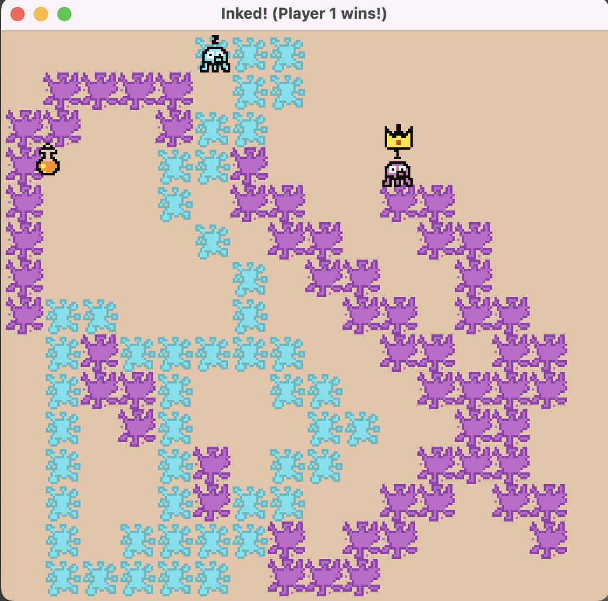

# Inked!

Author: Qiru Hu

Design: Two octopuses will try to paint as much grids of the canvas as possible in 30s. The octopus who paints more grids will win and receive a crown. This games allows 2 players to play together.

Screen Shot:

How Your Asset Pipeline Works:

My assests include 2 octopus sprites for [player 1](dist/resources/sprites/octopus.png) and [player 2](dist/resources/sprites/octopus2.png), [splash tile for player 1](dist/resources/sprites/splash.png), [splash tile for player 2](dist/resources/sprites/splash2.png), a [crown sprite](dist/resources/sprites/crown.png) and a [potion sprite](dist/resources/sprites/potion.png). All of the sprites and tiles are 16x16 png images. My asset pipeline will load the png images, divide them into 4 tiles and save the tile indices or sprite indices in Tile2x2 struct or Sprite2x2 struct.

The splash tiles will be painted to the background.

How To Play:

Player 1 uses left, right, up, down arrow keys to control the movement, and space bar to paint.
Player 2 uses a, w, s, d to move and TAB key to paint.
Players want to paint more grids than the opponent. 
Players can paint over other's painted grid.

A potion will be generated randomly throughout the game. The player who got the potion can move faster, thus painting more grids.

This game was built with [NEST](NEST.md).

